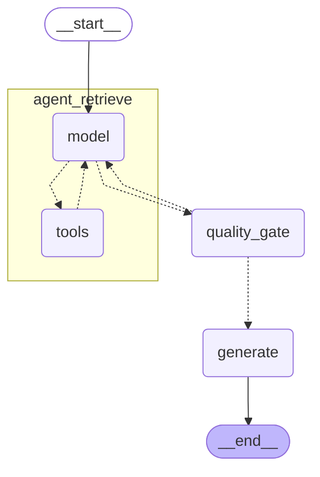

# Multi-Source Agentic RAG

A retrieval-augmented generation pipeline that answers regulatory compliance questions by intelligently routing across three heterogeneous data sources: **vector search** (regulatory PDFs), **SQL** (structured enforcement data), and **web search** (recent publications).

Built with LangGraph's 3-node pipeline architecture. An LLM agent decides which tools to call, a deterministic quality gate enforces retrieval policies, and a grounded generator produces cited answers.

> **Domain:** MAS (Monetary Authority of Singapore) regulatory compliance — 32 regulatory PDFs, 337 enforcement actions, 317 regulated entities. The architecture is corpus-swappable via the ingestion adapter pattern.

## Architecture



**Nodes:**

| Node | Role |
|------|------|
| `agent_retrieve` | ReAct tool-calling loop (gpt-4o-mini) — picks tools, evaluates results, retries |
| `quality_gate` | 3 deterministic policies, zero LLM calls — catches what the agent might rationalize |
| `generate` | Assembles context from all sources, enforces citation-per-claim grounding |

**Quality gate policies:**
1. **Primary source requirement** — regulatory answers must cite indexed sources, not web-only
2. **Empty results** — retry if untried tools remain; pass through for explicit "insufficient information"
3. **SQL cross-reference** — if SQL results cite specific regulations, trigger vector search for the cited text

## Tools

| Tool | Source | Use case |
|------|--------|----------|
| `vector_search` | OpenSearch (3,261 chunks, 1536-dim) | Interpretive questions — "What are MAS's CDD requirements for PEPs?" |
| `sql_query` | PostgreSQL (read-only, SELECT-only) | Factual lookups — "How many composition penalties in 2024?" |
| `web_search` | Tavily API | Recent publications, out-of-corpus content |

`vector_search` supports three modes: `hybrid` (BM25 + kNN + cross-encoder reranking), `keyword` (BM25), and `semantic` (kNN only).

## Quick Start

**Prerequisites:** Python 3.12+, Docker, OpenAI API key

```bash
# 1. Install
uv sync

# 2. Configure
cp .env.example .env
# Edit .env — set OPENAI_API_KEY (required), TAVILY_API_KEY (optional)

# 3. Start infrastructure
docker compose up -d

# 4. Set up OpenSearch index + search pipeline + bulk index documents
uv run python scripts/setup_opensearch.py

# 5. Run
uv run python main.py
```

**Example session:**

```
Initializing pipeline...
Connecting to OpenSearch... OK (3261 docs)
Connecting to PostgreSQL... OK (686 rows across 3 tables)

MAS Compliance RAG (type 'quit' to exit)
==================================================

> What enforcement actions has MAS taken for AML violations?
  [Retrieving... tools: sql_query]
  [Quality gate: passed]
  [Generating answer...]

MAS has taken numerous enforcement actions for AML/CFT violations...
[SQL Result] Between 2019-2024, there were 15 composition penalties...

Sources: enforcement_actions (SQL)
```

## Tech Stack

| Component | Technology |
|-----------|-----------|
| Orchestration | LangGraph (StateGraph, MemorySaver) |
| Agent | LangChain `create_agent` (ReAct loop) |
| LLM | OpenAI gpt-4o-mini |
| Embeddings | text-embedding-3-small (1536-dim) |
| Reranking | ms-marco-MiniLM-L-6-v2 (OpenSearch ML plugin, Python fallback) |
| Vector + keyword search | OpenSearch 2.18.0 |
| Structured data | PostgreSQL 16 |
| Web search | Tavily API |
| Token management | tiktoken (100k token history trimming) |

## Project Structure

```
├── main.py                          # CLI REPL entry point
├── docker-compose.yml               # OpenSearch + PostgreSQL
├── .env.example                     # Configuration template
│
├── src/msrag/
│   ├── graph.py                     # build_graph(), build_context(), routing
│   ├── state.py                     # PipelineState (TypedDict), Context (dataclass)
│   ├── server.py                    # FastAPI server (Phase 4)
│   ├── nodes/
│   │   ├── agent_retrieve.py        # Agent wrapper + tool result parsing
│   │   ├── quality_gate.py          # 3-policy deterministic gate
│   │   └── generate.py              # Grounded answer generation + citations
│   └── tools/
│       ├── builder.py               # Tool factory, prompt builder, schema parser
│       ├── vector_search.py         # OpenSearch hybrid search client
│       ├── sql_query.py             # Read-only PostgreSQL engine
│       └── web_search.py            # Tavily search wrapper
│
├── corpus/
│   ├── manifests/corpus_manifest.json   # Document registry (32 PDFs)
│   ├── ingestion_output/                # Chunked + embedded docs, metadata
│   └── data/sql/                        # Schema, seed data, views
│
└── scripts/
    ├── setup_opensearch.py          # Index + pipeline + bulk indexing
    └── verify_build_spec.py         # Implementation verification
```

## Configuration

Copy `.env.example` to `.env` and set:

| Variable | Required | Description |
|----------|----------|-------------|
| `OPENAI_API_KEY` | Yes | Embeddings + generation |
| `TAVILY_API_KEY` | No | Web search fallback (graceful degradation if absent) |
| `LANGCHAIN_TRACING_V2` | No | Enable LangSmith tracing |
| `LANGCHAIN_API_KEY` | No | LangSmith API key |

Docker service defaults (`localhost:9200` for OpenSearch, `localhost:5432` for PostgreSQL) are overridable via env vars.

## SQL Schema

3 tables + 3 pre-built views for the agent:

| Table | Rows | Key columns |
|-------|------|-------------|
| `enforcement_actions` | 337 | entity_name, action_type, violation_category, penalty_amount, regulation_breached |
| `regulatory_instruments` | 32 | instrument_type, title, applicable_sectors[], topic_tags[], status |
| `regulated_entities` | 317 | entity_name, entity_type, sector, licence_types[] |

| View | Purpose |
|------|---------|
| `enforcement_with_entities` | Joins enforcement actions with entity metadata |
| `enforcement_summary` | Aggregates by year, violation category, action type |
| `active_instruments` | Currently in-force regulatory instruments |

## LLM Budget

Typical query: **2-3 LLM calls** (agent: 1-2, generate: 1). Worst case ~5 with a quality gate retry. No hard limits — each call earns its place.
