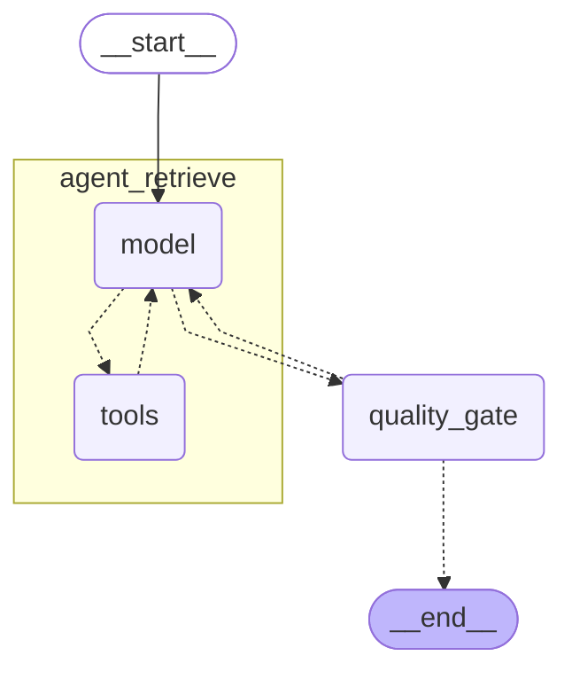

# Multi-Source Agentic RAG

A retrieval-augmented generation pipeline that answers regulatory compliance questions by intelligently routing across three heterogeneous data sources: **vector search** (regulatory PDFs), **SQL** (structured enforcement data), and **web search** (recent publications).

Built with LangGraph's 2-node pipeline architecture. An LLM agent decides which tools to call and produces a cited answer directly, while a deterministic quality gate enforces retrieval policies before returning the result.

> **Domain:** MAS (Monetary Authority of Singapore) regulatory compliance — 32 regulatory PDFs, 337 enforcement actions, 317 regulated entities. The architecture is corpus-swappable via the ingestion adapter pattern.


## Background

This project extends [Advanced Agentic RAG](https://github.com/lowkaihon/agentic-rag-langgraph), which evaluated retrieval architectures (HHEM hallucination detection, self-correction loops, two-stage reranking) on a single-corpus academic dataset. This applies those learnings to an enterprise setting where single-source RAG structurally fails: compliance queries span regulatory PDFs, structured enforcement data, and recent publications simultaneously. The architecture is simplified to a 2-node pipeline — the ReAct agent replaces the rewrite/evaluation nodes — while adding multi-source routing as the primary capability.

## Demo

**Live API:** https://d2l5kw630a12et.cloudfront.net

```bash
curl -X POST https://d2l5kw630a12et.cloudfront.net/v1/query \
  -H 'Content-Type: application/json' \
  -d '{"question": "What are MAS CDD requirements for PEPs?"}'
```

## Key Results

- **Correctness: 3.45/5.0 mean, 4.0/5.0 median** across 51 golden dataset questions
- **98% tool coverage** — agent selects the right tools on 50/51 questions
- **77.8% naive baseline failure rate** — vector-only approach fails on multi-source questions where agentic routing succeeds
- [Full evaluation details](#evaluation)

## Table of Contents

- [Architecture](#architecture)
- [Tools](#tools)
- [Quick Start](#quick-start)
- [Tech Stack](#tech-stack)
- [Project Structure](#project-structure)
- [Configuration](#configuration)
- [SQL Schema](#sql-schema)
- [Evaluation](#evaluation)

## Architecture



**Nodes:**

| Node | Role |
|------|------|
| `agent_retrieve` | ReAct tool-calling loop (gpt-5.4-mini) — picks tools, evaluates results, produces cited answer |
| `quality_gate` | 3 deterministic policies, zero LLM calls — catches what the agent might rationalize |

**Quality gate policies:**
1. **Primary source requirement** — regulatory answers must cite indexed sources, not web-only
2. **Empty results** — retry if untried tools remain; pass through for explicit "insufficient information"
3. **SQL cross-reference** — if SQL results cite specific regulations, trigger vector search for the cited text

## Tools

| Tool | Source | Use case |
|------|--------|----------|
| `vector_search` | OpenSearch (3,261 chunks, 1536-dim) | Interpretive questions — "What are MAS's CDD requirements for PEPs?" |
| `sql_query` | PostgreSQL (read-only, SELECT-only) | Factual lookups — "How many composition penalties in 2024?" |
| `web_search` | Tavily API | Recent publications, out-of-corpus content |

`vector_search` supports three modes: `hybrid` (BM25 + kNN + cross-encoder reranking), `keyword` (BM25), and `semantic` (kNN only).

## Quick Start

**Prerequisites:** Python 3.12+, Docker, OpenAI API key

```bash
# 1. Install
uv sync

# 2. Configure
cp .env.example .env
# Edit .env — set OPENAI_API_KEY (required), TAVILY_API_KEY (optional)

# 3. Start infrastructure
docker compose up -d

# 4. Set up OpenSearch index + search pipeline + bulk index documents
uv run python scripts/setup_opensearch.py

# 5. Run
uv run python main.py
```

## Tech Stack

| Component | Technology |
|-----------|-----------|
| Orchestration | LangGraph (StateGraph, MemorySaver) |
| Agent | LangChain `create_agent` (ReAct loop) |
| LLM | OpenAI gpt-5.4-mini |
| Embeddings | text-embedding-3-small (1536-dim) |
| Reranking | ms-marco-MiniLM-L-6-v2 (OpenSearch ML plugin, Python fallback) |
| Vector + keyword search | OpenSearch 2.18.0 |
| Structured data | PostgreSQL 16 |
| Web search | Tavily API |
| Token management | tiktoken (100k token history trimming) |

## Project Structure

```
├── main.py                          # CLI REPL entry point
├── docker-compose.yml               # OpenSearch + PostgreSQL
├── .env.example                     # Configuration template
│
├── src/msrag/
│   ├── graph.py                     # build_graph(), build_context(), routing
│   ├── state.py                     # State (TypedDict), Context (dataclass)
│   ├── server.py                    # FastAPI server
│   ├── nodes/
│   │   ├── agent_retrieve.py        # Agent wrapper, tool result parsing, cited answer extraction
│   │   └── quality_gate.py          # 3-policy deterministic gate
│   └── tools/
│       ├── builder.py               # Tool factory, prompt builder, schema parser
│       ├── vector_search.py         # OpenSearch hybrid search client
│       ├── sql_query.py             # Read-only PostgreSQL engine
│       └── web_search.py            # Tavily search wrapper
│
├── evaluation/
│   ├── golden_dataset.json          # 51 questions across 4 categories + 5 multi-turn chains
│   └── results/                     # Scored evaluation outputs (gitignored)
│
├── corpus/
│   ├── manifests/corpus_manifest.json   # Document registry (32 PDFs)
│   ├── ingestion_output/                # Chunked + embedded docs, metadata
│   └── data/sql/                        # Schema, seed data, views
│
├── scripts/
│   ├── setup_opensearch.py          # Index + pipeline + bulk indexing
│   ├── run_evaluation.py            # Evaluation harness (pipeline + naive baseline)
│   └── evaluate_judges.py           # LLM-as-judge scoring (correctness, completeness, groundedness)
│
└── infra/                           # Terraform (ECS + VPC) for AWS deployment
```

## Configuration

Copy `.env.example` to `.env` and set:

| Variable | Required | Description |
|----------|----------|-------------|
| `OPENAI_API_KEY` | Yes | Embeddings + generation |
| `TAVILY_API_KEY` | No | Web search fallback (graceful degradation if absent) |
| `LANGCHAIN_TRACING_V2` | No | Enable LangSmith tracing |
| `LANGCHAIN_API_KEY` | No | LangSmith API key |

Docker service defaults (`localhost:9200` for OpenSearch, `localhost:5432` for PostgreSQL) are overridable via env vars.

## SQL Schema

3 tables + 3 pre-built views for the agent:

| Table | Rows | Key columns |
|-------|------|-------------|
| `enforcement_actions` | 337 | entity_name, action_type, violation_category, penalty_amount, regulation_breached |
| `regulatory_instruments` | 32 | instrument_type, title, applicable_sectors[], topic_tags[], status |
| `regulated_entities` | 317 | entity_name, entity_type, sector, licence_types[] |

| View | Purpose |
|------|---------|
| `enforcement_with_entities` | Joins enforcement actions with entity metadata |
| `enforcement_summary` | Aggregates by year, violation category, action type |
| `active_instruments` | Currently in-force regulatory instruments |

## Evaluation

### Metrics

Three LLM judges (gpt-5.4-mini) score each question:

| Judge | Scale | What it measures |
|-------|-------|-----------------|
| **Correctness** | 1-5 | Does the answer correctly address the question? |
| **Completeness** | 0.0-1.0 | Per-aspect coverage for multi-source questions (Category 4 only) |
| **Groundedness** | 0.0-1.0 | Is every factual claim supported by retrieved context? |

Diagnostic metrics (no LLM needed): tool coverage, quality gate trigger rate, first-attempt tool accuracy, latency P50/P95.

### Golden Dataset

51 questions across 4 categories + 5 multi-turn chains (17 turns total):

| Category | Count | Focus | Expected Tools |
|----------|-------|-------|----------------|
| 1 — Document retrieval | 21 | Regulatory PDF content | vector_search |
| 2 — Structured data | 14 | Enforcement/entity lookups | sql_query |
| 3 — Temporal/web | 7 | Recent publications, comparisons | web_search |
| 4 — Multi-source | 9 | Cross-source synthesis | multiple |

### Results

**Overall:**

| Metric | Score |
|--------|-------|
| Correctness (mean / median) | 3.45 / 4.0 |
| Completeness (mean) | 0.581 |
| Groundedness (mean) | 0.625 |

**By Category:**

| Category | Count | Correctness |
|----------|-------|-------------|
| 1 (Document) | 21 | 4.00 |
| 2 (Structured) | 14 | 3.14 |
| 3 (Web) | 7 | 3.29 |
| 4 (Multi-source) | 9 | 2.78 |

**Diagnostics:**

| Metric | Value |
|--------|-------|
| Tool coverage | 98.0% |
| Quality gate trigger rate | 2.0% |
| First-attempt tool accuracy | 96.1% |
| Latency P50 / P95 | 9.6s / 20.0s |

**Naive Baseline Comparison (Category 4):**

The naive baseline uses vector-search-only (no SQL, no agent routing) on the 9 multi-source questions:

| Metric | Naive (vector-only) |
|--------|---------------------|
| Failure rate (score ≤ 2) | 77.8% |

7 out of 9 multi-source questions got critically incomplete answers without agentic routing.

### Run Evaluation

```bash
# Step 1: Run pipeline + naive baseline on golden dataset
uv run python scripts/run_evaluation.py --include-naive

# Step 2: Score with LLM judges
uv run python scripts/evaluate_judges.py
```
